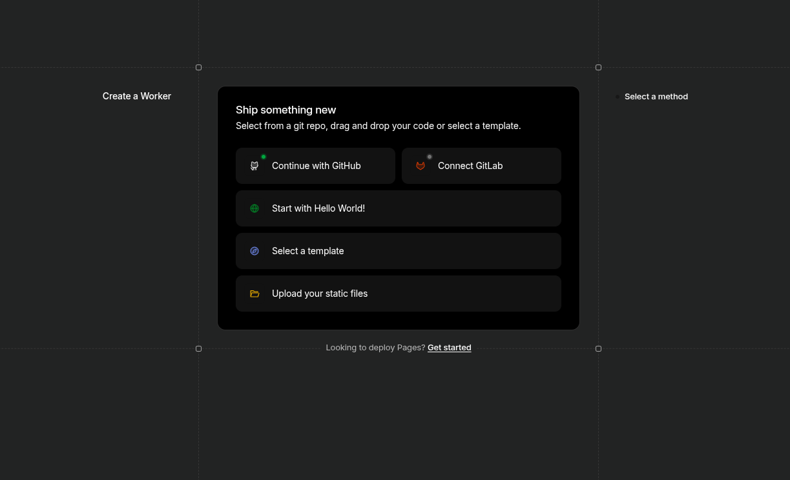
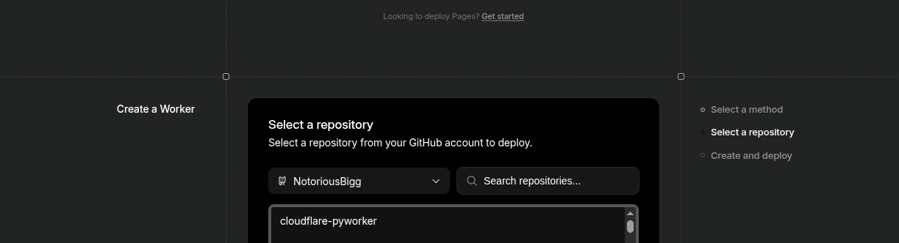
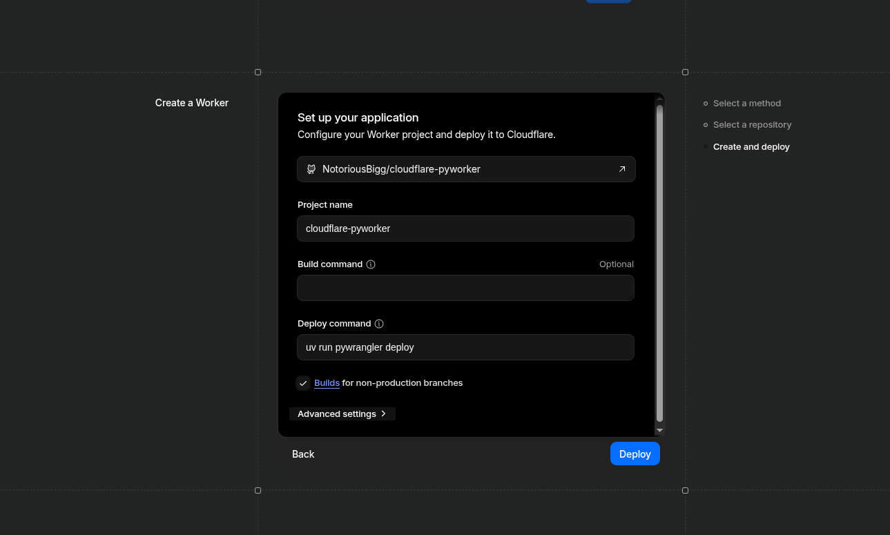
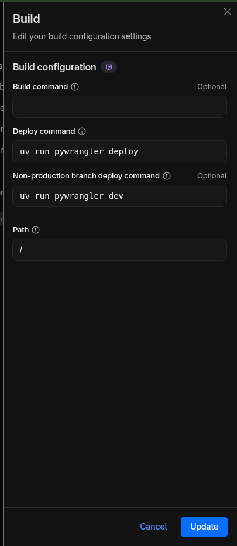

# Cloudflare Python Worker

A guide and template for deploying Python-based Cloudflare Workers using FastAPI and `uv`.

## Prerequisites

Before getting started, ensure you have the following installed:

- **[Node.js](https://nodejs.org/)**: Required for running Wrangler.
- **[uv](https://github.com/astral-sh/uv)**: A fast Python package installer and resolver used for managing dependencies and environments.

## Quick Start

### 1. Initialize the Project

Run the following commands in your project directory (using your system terminal):

```bash
uv init
uv tool install workers-py
uv run pywrangler init
```

- `uv init`: Initializes a new Python project.
- `uv tool install workers-py`: Installs the `workers-py` tool.
- `uv run pywrangler init`: Creates the necessary `wrangler.jsonc` configuration file.

### 2. Local Development

To run the worker locally for testing:

```bash
uv run pywrangler dev
```

### 3. Deployment

#### Option A: CLI Deployment (Recommended)

To deploy your worker directly from the command line:

```bash
uv run pywrangler deploy
```

#### Option B: GitHub Integration (via Cloudflare Dashboard)

If you prefer a GUI-based approach or want to set up CI/CD, you can use the Cloudflare Workers & Pages dashboard:

1. **Fork this repository**: [Fork Link](https://github.com/NotoriousBigg/cloudflare-pyworker/fork)
2. **Create a New Application**: In the Cloudflare dashboard, select "Create Application" > "Pages" or "Workers" and choose **"Connect to Git"**.
   - 
3. **Connect GitHub**: Select your repository and click **Next**.
   - 
4. **Configure Settings**: Ensure the project name matches the `name` field in your `wrangler.jsonc` and `package.json`.
   - 
   - **Important**: If your project already has a `pyproject.toml` file, you do **not** need to provide a custom build command. The Cloudflare build system will detect and use it automatically.
5. **Deploy**: Click the **"Save and Deploy"** button. Your build status should look like this:
   - 

## Adding Routes

You can add new routes in `src/entry.py`. For larger projects, you can use FastAPI's `APIRouter` to organize your code.

```python
from fastapi import FastAPI, APIRouter

app = FastAPI()
router = APIRouter()

@router.get("/hello")
def read_hello():
    return {"message": "Hello World"}

app.include_router(router)
```

## Managing Dependencies

Cloudflare Python Workers use `pyproject.toml` for dependency management. Traditional `requirements.txt` or `cf-requirements.txt` files may not be reliably supported.

Add your dependencies to the `dependencies` section of your `pyproject.toml`:

```toml
dependencies = [
    "fastapi",
    "webtypy>=0.1.7",
    "httpx",
]
```

After modifying dependencies, ensure you run the build commands or update your environment before pushing to GitHub.


